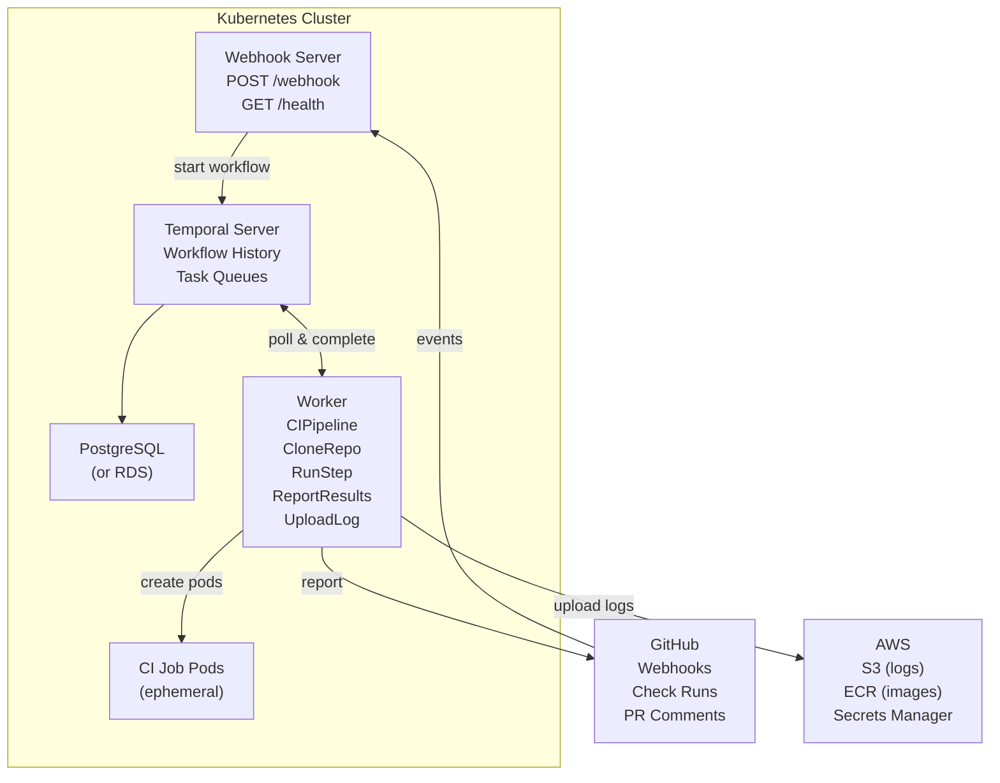
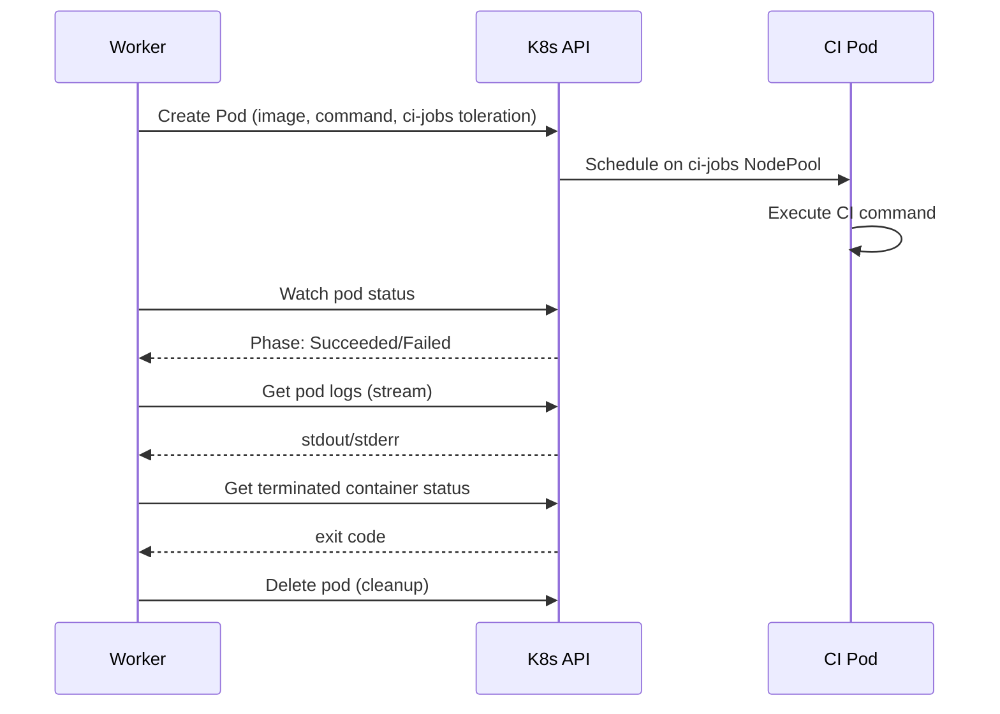
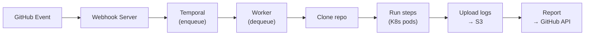
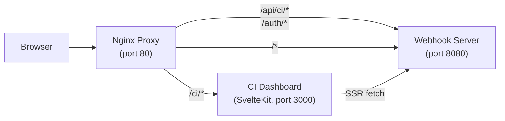

# Architecture

## System Overview

## Workflow Execution

The `CIPipeline` workflow is the core orchestration unit:

Each activity is independently retryable. If the worker crashes mid-pipeline, Temporal replays the workflow from the last completed activity.

## K8s Pod Lifecycle

When `RunStep` executes in K8s mode:

## Security Model

| Layer | Mechanism |
|-------|-----------|
| **Webhook validation** | HMAC-SHA256 signature verification on every GitHub event |
| **Secret storage** | File mounts from K8s Secrets (local) or AWS Secrets Manager (prod) |
| **IAM** | EKS Pod Identity — each component gets least-privilege IAM role |
| **Network isolation** | CI jobs run on dedicated `ci-jobs` NodePool with taints |
| **Container isolation** | Each CI step runs in its own ephemeral pod |

## Data Flow

No CI state is stored in the webhook server or worker — Temporal owns all execution state. Both components are stateless and horizontally scalable.

## CI Dashboard

The CI Dashboard is a SvelteKit application (`ui/` directory) that provides a web UI for monitoring builds, repos, and analytics.

### Components

| Component | Role |
|-----------|------|
| `ui/` (SvelteKit) | Server-rendered dashboard. Pages: builds, build detail, repos, triggers, analytics |
| Webhook server `/api/ci/*` | CI API layer — queries Temporal workflow history for build data |
| Webhook server `/auth/*` | GitHub OAuth login, session management |
| Nginx ConfigMap | Routes `/ci/*` to dashboard, `/api/ci/*` and `/auth/*` to webhook server |

### Authentication

GitHub OAuth with session cookies. The webhook server handles the OAuth flow:

1. `GET /auth/github` → redirects to GitHub authorize URL
2. `GET /auth/github/callback` → exchanges code for token, creates session
3. `GET /auth/me` → returns current user info
4. `POST /auth/logout` → clears session

When `PUBLIC_READ=true`, read-only API endpoints (`/api/ci/builds`, `/api/ci/repos`, `/api/ci/analytics`) are accessible without authentication. Write endpoints (e.g., marking notifications read) always require auth.

### Nginx Proxy Routing

The helm chart deploys an nginx ConfigMap that routes traffic:

| Path | Backend | Notes |
|------|---------|-------|
| `/ci/*` | CI Dashboard (port 3000) | WebSocket upgrade for HMR in dev |
| `/api/ci/*` | Webhook server (port 8080) | CI API endpoints |
| `/auth/*` | Webhook server (port 8080) | OAuth flow |
| `/_app/immutable/*` | Webhook server | Cached 7 days with `immutable` header |
| `/api/*` | Webhook server | Other API endpoints (repos, triggers, locks) |
| `/*` | Webhook server | Catch-all |

### Notification System

Build failure and recovery notifications flow through two channels:

1. **Slack** — The `NotifySlack` activity sends messages to a per-repo webhook URL (configured in repo registration). Includes repo, ref, status, step count, duration, and a link to the Temporal workflow.

2. **In-app** — The `NotificationStore` (in-memory, capped at 100 entries) tracks `build_failed` and `build_recovered` events. The dashboard polls `GET /api/ci/notifications` and users can mark notifications read via `POST /api/ci/notifications/read`.
