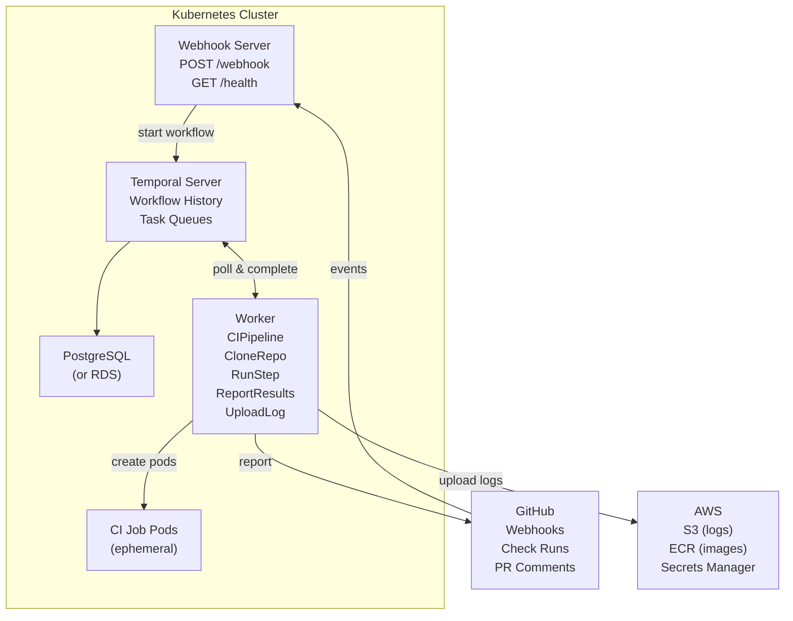
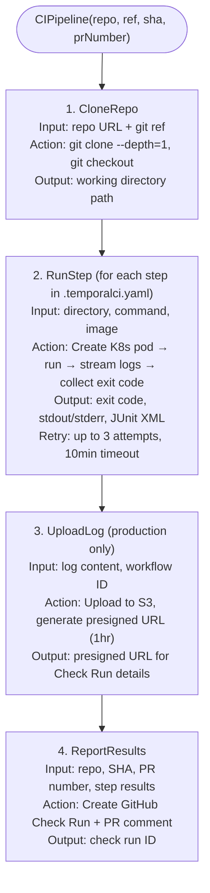
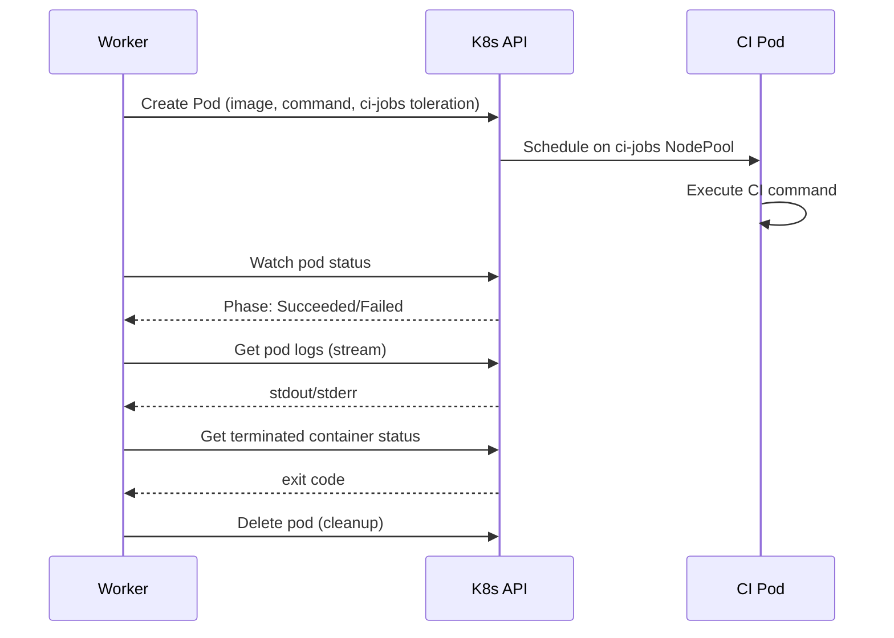
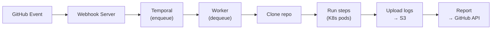

# Architecture

## System Overview

## Workflow Execution

The `CIPipeline` workflow is the core orchestration unit:

Each activity is independently retryable. If the worker crashes mid-pipeline, Temporal replays the workflow from the last completed activity.

## K8s Pod Lifecycle

When `RunStep` executes in K8s mode:

## Security Model

| Layer | Mechanism |
|-------|-----------|
| **Webhook validation** | HMAC-SHA256 signature verification on every GitHub event |
| **Secret storage** | File mounts from K8s Secrets (local) or AWS Secrets Manager (prod) |
| **IAM** | EKS Pod Identity — each component gets least-privilege IAM role |
| **Network isolation** | CI jobs run on dedicated `ci-jobs` NodePool with taints |
| **Container isolation** | Each CI step runs in its own ephemeral pod |

## Data Flow

No CI state is stored in the webhook server or worker — Temporal owns all execution state. Both components are stateless and horizontally scalable.
